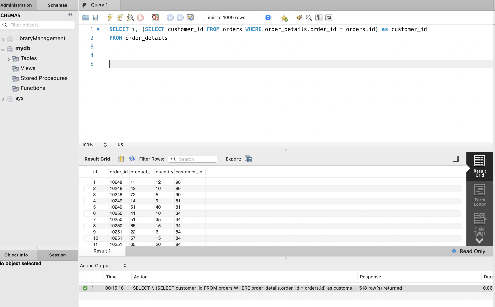
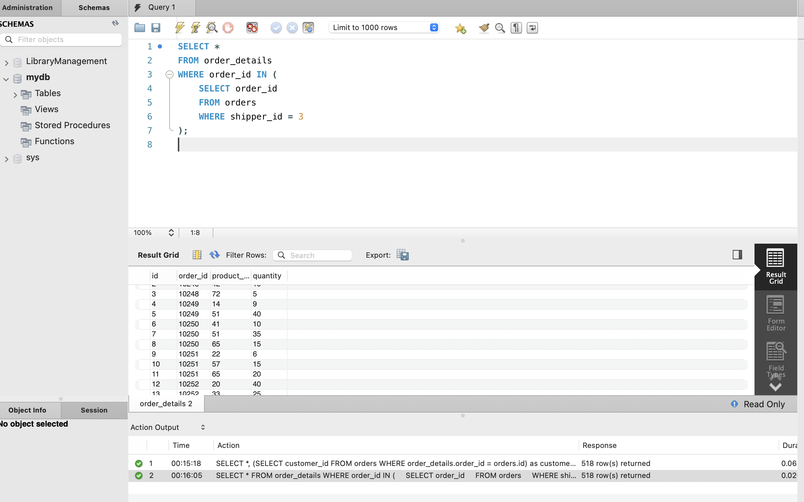
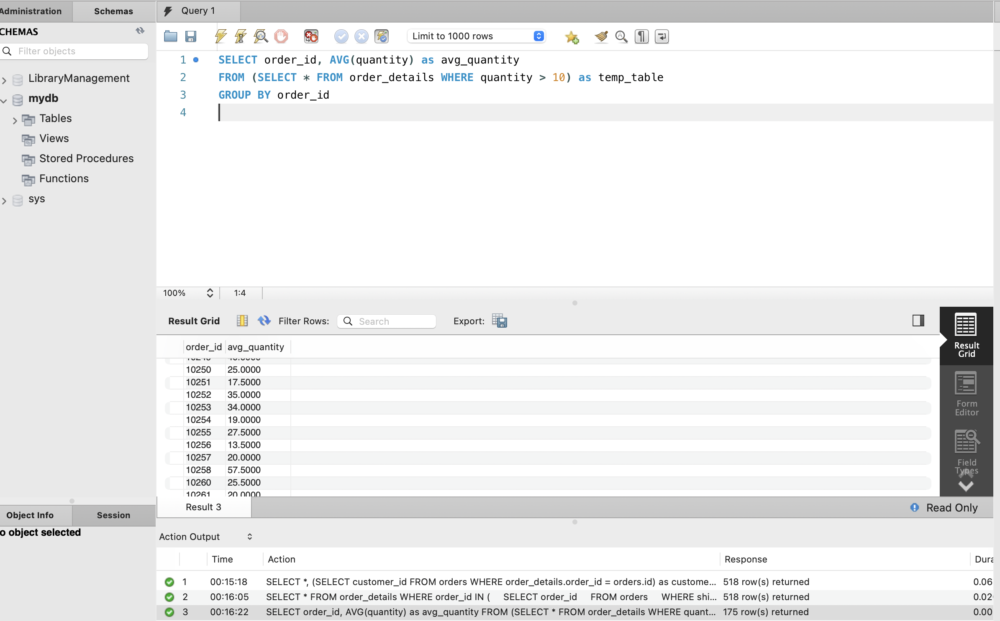
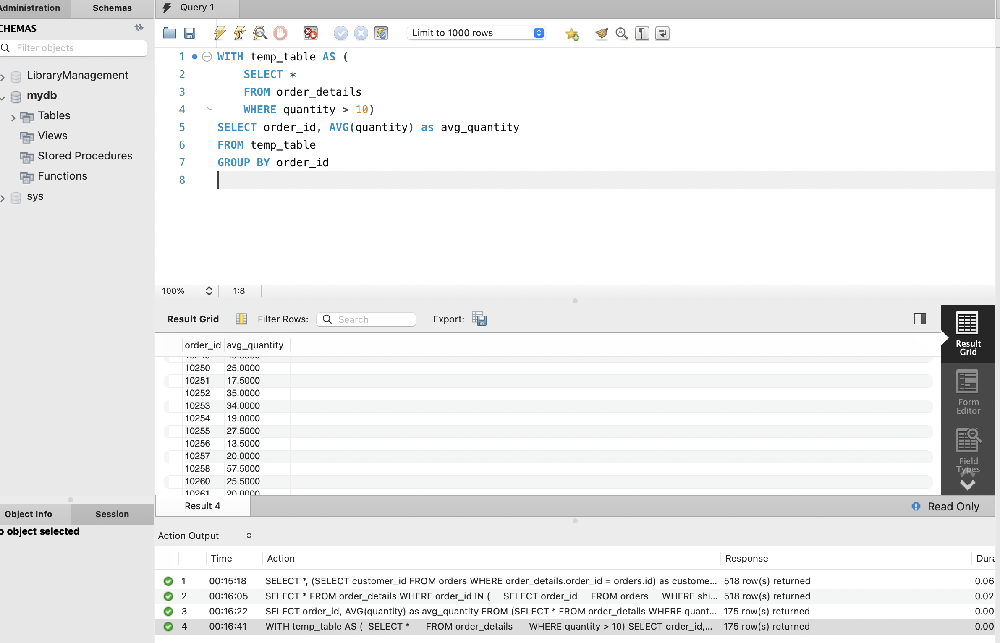
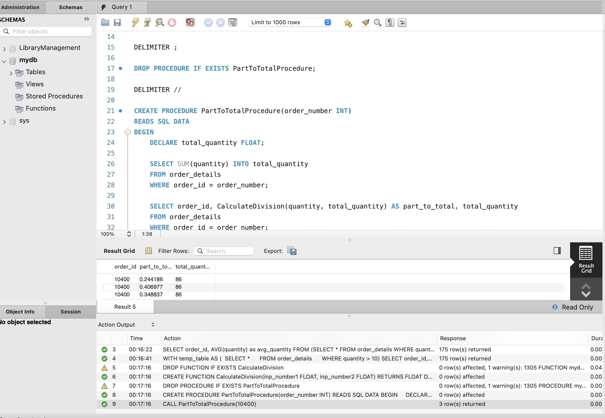

# Домашнє завдання до Теми 5. Вкладені запити. Повторне використання коду

### Результат виконаного ДЗ

1. Напишіть SQL запит, який буде відображати таблицю order_details та поле customer_id з таблиці orders відповідно для кожного поля запису з таблиці order_details. Це має бути зроблено за допомогою вкладеного запиту в операторі SELECT.
```js
SELECT *, (SELECT customer_id FROM orders WHERE order_details.order_id = orders.id) as customer_id 
FROM order_details
```


2. Напишіть SQL запит, який буде відображати таблицю order_details. Відфільтруйте результати так, щоб відповідний запис із таблиці orders виконував умову shipper_id=3. Це має бути зроблено за допомогою вкладеного запиту в операторі WHERE.
```js
SELECT *
FROM order_details
WHERE order_id IN (
    SELECT order_id
    FROM orders
    WHERE shipper_id = 3
);
```


3. Напишіть SQL запит, вкладений в операторі FROM, який буде обирати рядки з умовою quantity>10 з таблиці order_details. Для отриманих даних знайдіть середнє значення поля quantity — групувати слід за order_id.
```js
SELECT order_id, AVG(quantity) as avg_quantity
FROM (SELECT * FROM order_details WHERE quantity > 10) as temp_table
GROUP BY order_id
```


4. Розв’яжіть завдання 3, використовуючи оператор WITH для створення тимчасової таблиці temp. Якщо ваша версія MySQL більш рання, ніж 8.0, створіть цей запит за аналогією до того, як це зроблено в конспекті.
```js
WITH temp_table AS (
	SELECT * 
    FROM order_details 
    WHERE quantity > 10)
SELECT order_id, AVG(quantity) as avg_quantity
FROM temp_table
GROUP BY order_id
```


5. Створіть функцію з двома параметрами, яка буде ділити перший параметр на другий. Обидва параметри та значення, що повертається, повинні мати тип FLOAT.Використайте конструкцію DROP FUNCTION IF EXISTS. Застосуйте функцію до атрибута quantity таблиці order_details .
```js
DROP FUNCTION IF EXISTS CalculateDivision;

DELIMITER //

CREATE FUNCTION CalculateDivision(inp_number1 FLOAT, inp_number2 FLOAT)
RETURNS FLOAT
DETERMINISTIC
NO SQL
BEGIN
	DECLARE result FLOAT;
    SET result = inp_number1 / inp_number2;
    RETURN result;
END //

DELIMITER ;

DROP PROCEDURE IF EXISTS PartToTotalProcedure;

DELIMITER //

CREATE PROCEDURE PartToTotalProcedure(order_number INT)
READS SQL DATA
BEGIN
    DECLARE total_quantity FLOAT;
    
    SELECT SUM(quantity) INTO total_quantity
    FROM order_details
    WHERE order_id = order_number;
    
    SELECT order_id, CalculateDivision(quantity, total_quantity) AS part_to_total, total_quantity
    FROM order_details
    WHERE order_id = order_number;
END //

DELIMITER ;

CALL PartToTotalProcedure(10400);
```



